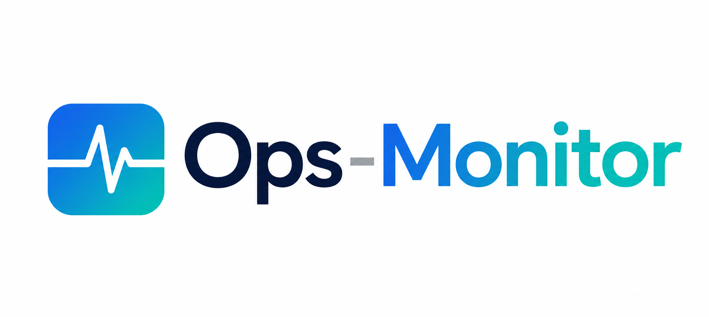
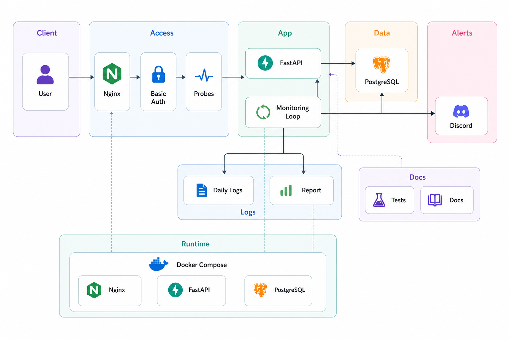

<div align="center">
  <h1>Ops Monitor</h1>
  <p>Docker 컨테이너 기반 서비스 상태 점검과 운영 흐름 연습을 위한 모니터링 프로젝트</p>
  
  <br />
  <br />
  <p>
    <code>FastAPI</code>
    <code>PostgreSQL</code>
    <code>Docker Compose</code>
    <code>demo-notes</code>
    <code>Nginx</code>
  </p>
</div>

---

## 프로젝트 개요

Ops Monitor는 서비스의 기본 생존 신호, DB 연결 상태, 시스템 자원 사용량, 최근 장애 이벤트를 한곳에서 확인할 수 있도록 만든 운영 모니터링 연습 프로젝트입니다.

이 프로젝트는 아래 흐름을 직접 구현하고 검증하는 데 초점을 둡니다.

- 공개 상태 확인 API와 보호된 운영 API 분리
- 주기적 모니터링 루프와 장애/복구 이벤트 기록
- 일자별 로그와 간단한 운영 리포트 생성
- 운영 화면에서 현재 설정 상태까지 함께 확인

## 이번 보강 포인트

최근 변경으로 런타임 설정 안정성, 운영 대시보드, 데모 서비스 연동을 함께 보강했습니다.

- 잘못된 모니터링 설정값이 들어와도 앱이 안전한 기본값으로 동작
- `/monitoring/status`에서 임계치, 인증 설정, 설정 경고를 함께 확인 가능
- `/dashboard`에서 서비스 상태, 최근 알림, 설정 상태, 자원 사용량을 한글 운영 화면으로 확인 가능
- `/admin/database/restart`로 운영 화면에서 DB 재시작 요청 가능
- `demo-notes`를 별도 서비스로 분리하고 PostgreSQL 기반 메모 저장/수정/삭제 지원

자세한 내용은 [docs/10_runtime_configuration.md](docs/10_runtime_configuration.md), [docs/11_dashboard_work_breakdown.md](docs/11_dashboard_work_breakdown.md), [study/dashboard-notes-refinement.md](study/dashboard-notes-refinement.md), [study/why-console-dashboard.md](study/why-console-dashboard.md)에서 확인할 수 있습니다.

## 주요 기능

| 구분 | 내용 |
|---|---|
| Public Health | `/`, `/livez`, `/readyz` |
| Protected Ops API | `/health`, `/system`, `/alerts`, `/monitoring/status` |
| Dashboard | `/dashboard` |
| Demo Service | `demo-notes` 메모 서비스 (`http://localhost:8010`) |
| Monitoring | DB 상태, 메모리, 디스크 사용량, 이벤트 감지 |
| Alerts | 웹훅 기반 장애 및 복구 알림 |
| Logging | 애플리케이션 로그, 이벤트 로그, 일일 리포트 생성 |
| Security | Basic Auth, Trusted Host, rate limit, 숨김 경로 차단 |

## 아키텍처

<div align="center">
  
</div>

전체 흐름은 다음과 같습니다.

```text
Client
  ->
Nginx
  ->
FastAPI
  ->
PostgreSQL
  ->
Monitoring Loop
  ->
Discord Webhook
```

### 구성 요소

| 구성 요소 | 역할 |
|---|---|
| Nginx | 요청 전달, 기본 보안 헤더, 접근 제어 |
| FastAPI | 상태 조회 API, 대시보드, 운영 로직 제공 |
| PostgreSQL | 연결 상태 확인 대상 |
| Monitoring Loop | 주기적 상태 점검과 이벤트 생성 |
| Alert Channel | 장애 및 복구 알림 전송 |
| Daily Logs | 날짜별 로그와 운영 리포트 생성 |

## 빠른 시작

### 1. 환경 변수 준비

`.env.example`을 기준으로 `.env`를 준비합니다.

중요 설정:

- `DATABASE_URL`
- `MONITOR_USERNAME`
- `MONITOR_PASSWORD`
- `MONITOR_INTERVAL_SECONDS`
- `MEMORY_ALERT_THRESHOLD`
- `DISK_ALERT_THRESHOLD`
- `DISCORD_WEBHOOK_URL` 선택

유효 범위:

- `MONITOR_INTERVAL_SECONDS`: `5` ~ `3600`
- `MEMORY_ALERT_THRESHOLD`: `1` ~ `100`
- `DISK_ALERT_THRESHOLD`: `1` ~ `100`

### 2. 의존성 설치

```bash
pip install -r requirements.txt
```

### 3. 로컬 실행

```bash
uvicorn app.main:app --reload
```

### 4. Docker Compose 실행

```bash
docker compose up --build
```

### 5. 데모 메모 서비스 확인

브라우저에서 아래 주소로 접속할 수 있습니다.

```text
http://localhost:8010
```

헬스체크 경로:

```text
http://localhost:8010/healthz
```

지원 기능:

- 메모 등록
- 메모 수정
- 메모 삭제
- PostgreSQL 기반 영속 저장

## 엔드포인트

### 공개 엔드포인트

| Method | Path | 설명 |
|---|---|---|
| GET | `/` | 기본 확인 |
| GET | `/livez` | 프로세스 생존 확인 |
| GET | `/readyz` | 준비 상태 확인 |

### 보호된 엔드포인트

| Method | Path | 설명 |
|---|---|---|
| GET | `/health` | 앱 및 DB 상태 |
| GET | `/system` | 시스템 자원 상태 |
| GET | `/alerts` | 최근 이벤트 이력 |
| GET | `/monitoring/status` | 모니터링 루프 상태와 런타임 설정 메타데이터 |
| GET | `/dashboard` | 운영 대시보드 |

## 운영 시 확인 포인트

`.env`를 바꾼 뒤에는 아래 세 가지를 같이 확인하는 것을 권장합니다.

1. `GET /monitoring/status`에서 주기, 임계치, `config_warnings` 확인
2. `/dashboard`에서 설정 상태, DB 상태, 최근 알림 흐름 확인
3. `/health`에서 `database`, `demo_notes` 상태가 함께 정상인지 확인
4. 보호된 API가 Basic Auth로 정상 보호되는지 확인

로그는 아래 경로에 날짜별로 쌓입니다.

| 경로 | 설명 |
|---|---|
| `logs/application/YYYY-MM-DD.log` | 애플리케이션 로그 |
| `logs/access/YYYY-MM-DD.log` | 접근 로그 |
| `logs/events/YYYY-MM-DD.jsonl` | 이벤트 원본 로그 |
| `logs/reports/YYYY-MM-DD.md` | 일일 리포트 |

## 테스트

전체 테스트 실행:

```bash
.venv\Scripts\python.exe -m unittest discover -s tests
```

핵심 설정/대시보드 테스트:

```bash
.venv\Scripts\python.exe -m unittest tests.test_config tests.test_dashboard_api tests.test_monitoring_status
```

## 커밋 원칙

```text
init   : 프로젝트 초기 설정
feat   : 기능 추가
infra  : 인프라 및 실행 환경 변경
test   : 테스트 추가 또는 보강
docs   : 문서 작성 및 수정
fix    : 오류 수정
chore  : 기타 정리
ci     : CI 설정 변경
```

## 문서 모음

| 문서 | 내용 |
|---|---|
| [docs/01_srs.md](docs/01_srs.md) | 요구사항 정리 |
| [docs/02_architecture.md](docs/02_architecture.md) | 아키텍처 설명 |
| [docs/03_api_spec.md](docs/03_api_spec.md) | API 명세 |
| [docs/04_erd.md](docs/04_erd.md) | 데이터 모델 |
| [docs/05_docker_compose_design.md](docs/05_docker_compose_design.md) | Compose 설계 |
| [docs/06_troubleshooting.md](docs/06_troubleshooting.md) | 문제 해결 기록 |
| [docs/07_security.md](docs/07_security.md) | 기본 보안 정리 |
| [docs/08_runtime_security.md](docs/08_runtime_security.md) | 런타임 보안 보강 |
| [docs/09_monitoring_interval_update.md](docs/09_monitoring_interval_update.md) | 모니터링 간격 조정 기록 |
| [docs/10_runtime_configuration.md](docs/10_runtime_configuration.md) | 런타임 설정 검증과 대시보드 보강 가이드 |
| [docs/11_dashboard_work_breakdown.md](docs/11_dashboard_work_breakdown.md) | 대시보드 개선 작업 분해 |
| [study/dashboard-notes-refinement.md](study/dashboard-notes-refinement.md) | 대시보드와 메모 서비스 설계 고민 및 복구 기록 |
| [study/why-console-dashboard.md](study/why-console-dashboard.md) | 대시보드를 콘솔형으로 잡은 이유와 판단 기준 |
| [docs/operation-log.md](docs/operation-log.md) | 작업 기록 |
