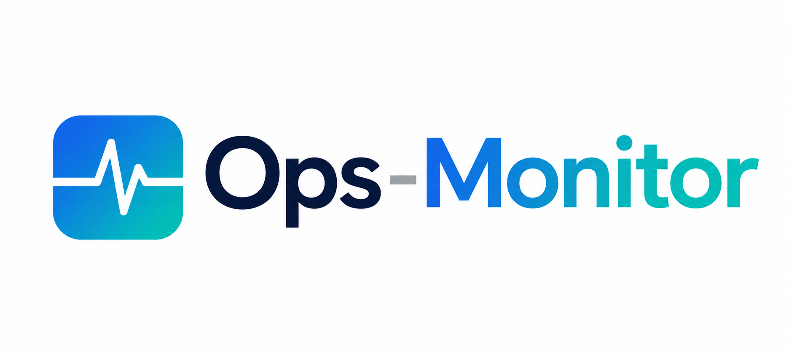
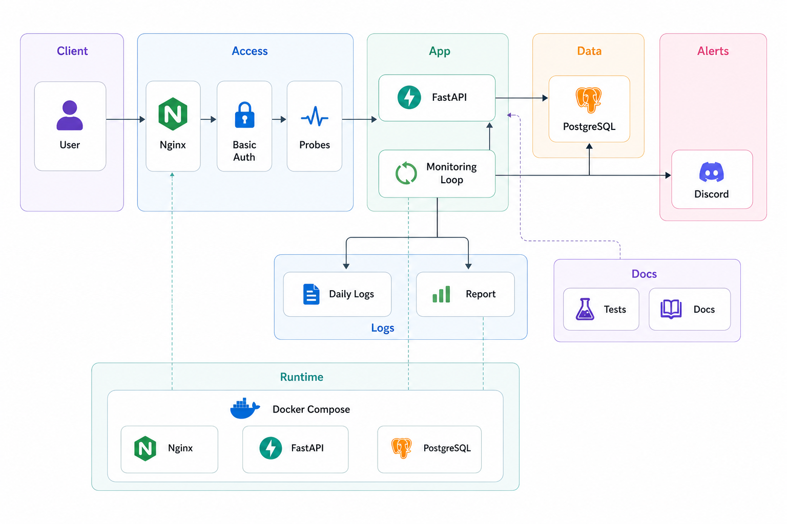

<div align="center">
  <h1>Ops Monitor</h1>
  <p>서비스의 가용성, 준비 상태, 상태 변화, 운영 조치 이력을 추적하는 모니터링 프로젝트</p>
  
  <br />
  <br />
  <p>
    <code>FastAPI</code>
    <code>PostgreSQL</code>
    <code>Docker Compose</code>
    <code>Nginx</code>
    <code>Dashboard</code>
    <code>Monitoring Run Report</code>
  </p>
</div>

---

## 프로젝트 개요

Ops Monitor는 서비스의 가용성, 준비 상태, 상태 변화, 운영 조치 이력을 추적하는 모니터링 프로젝트입니다.

FastAPI, PostgreSQL, Docker Compose, Nginx로 구성했으며, 점검, 장애 감지, 복구 확인 흐름을 구현하고 검증하는 데 초점을 맞췄습니다.

- 지금 서비스는 살아 있는가
- 지금 요청을 받을 준비가 되었는가
- 장애는 현재 상태인가, 방금 발생한 전이인가
- 어떤 점검 대상을 실제로 감시하고 있고, 어떤 대상은 예외 규칙으로 제외했는가
- 운영자가 방금 수행한 조치가 무엇이며, 그 결과는 어땠는가

---

## 핵심 구현 포인트

### 1. 상태 분리

`/livez`와 `/readyz`를 나누어 프로세스 생존과 실제 서비스 가능 상태를 구분합니다.  
운영자는 단순히 "앱이 떠 있다"가 아니라 "지금 트래픽을 받아도 되는가"를 기준으로, WEB/WAS 관점에서 판단할 수 있습니다.

### 2. 전이 기반 장애 감지

장애를 현재 값 하나로만 보지 않고, `정상 -> 비정상`, `비정상 -> 정상` 전이를 기준으로 감지합니다.  
이 방식은 중복 알림을 줄이고, 복구 확인까지 같은 흐름 안에서 추적하기 좋습니다.

### 3. 실행 단위 리포트

모니터링 루프 1회 실행이 끝날 때마다 어떤 대상을 점검했고, 무엇을 제외했고, 어떤 이벤트가 발생했는지를 실행 단위로 기록합니다.  
즉, "이벤트 로그"와 "점검 실행 기록"을 분리해 운영 분석에 더 적합한 구조를 제공합니다.

### 4. 운영 액션 추적

대시보드에서 수행한 DB 재시작 요청은 누가 언제 실행했는지 결과와 함께 남깁니다.  
이 프로젝트에서는 상태 조회뿐 아니라 조치 이력까지 남겨야 운영 문맥이 완성된다고 판단했습니다.

---

## 주요 기능

| 구분 | 기능 |
|---|---|
| Public Health | `/`, `/livez`, `/readyz` |
| Protected Ops API | `/health`, `/system`, `/alerts`, `/monitoring/status` |
| Dashboard | `/dashboard` 운영 화면 |
| Monitoring Targets | DB, demo-notes, 이후 확장 가능한 체크 대상 레지스트리 |
| Run Report | `logs/runs`, `logs/run-reports`에 실행 단위 기록 저장 |
| Alert History | 장애, 복구, 자원 경고, 운영 액션 이력 |
| Admin Action | `/admin/database/restart`를 통한 보호된 운영 조치 |
| Security | Basic Auth, Trusted Host, 제한된 CORS, 문서 비노출 기본값 |

---

## 운영 흐름

### 시나리오 1. 서비스 준비 상태 확인

운영자는 먼저 `/readyz`를 호출해 서비스가 요청을 받을 준비가 되었는지 확인합니다.

- `ready`: DB 연결까지 포함해 준비 완료
- `not_ready`: 프로세스는 살아 있어도 실제 서비스 준비는 미완료

### 시나리오 2. 대시보드에서 이상 징후 파악

운영자는 `/dashboard`에서 다음을 한 번에 확인할 수 있습니다.

- API / DB / 부가 서비스 상태
- 메모리 / 디스크 사용량
- 최근 알림 흐름
- 설정 경고
- 활성 점검 대상과 제외된 점검 대상

### 시나리오 3. 운영 액션 수행과 이력 확인

필요 시 보호된 관리자 액션으로 DB 재시작을 요청할 수 있으며, 결과는 이벤트 이력에 함께 기록됩니다.

---

## 아키텍처 개요

<div align="center">
  
</div>

```text
Client
  ->
Nginx
  ->
FastAPI
  ->
Public Health APIs (/ /livez /readyz)
  ->
Protected Ops APIs (/health /system /alerts /monitoring/status /dashboard)
  ->
Monitoring Loop
  ->
Monitoring Targets (database, demo_notes, system resource)
  ->
Alert History / Run Report / Discord Webhook
```

### 구성 요소

| 구성 요소 | 선택 이유 |
|---|---|
| FastAPI | 공개 헬스 체크와 보호된 운영 API를 같은 서비스 안에서 분리하기 쉬움 |
| PostgreSQL | 준비 상태 판단과 저장소 연결 시나리오를 함께 검증할 수 있음 |
| Docker Compose | Nginx, app, db, demo-notes 구성을 한 번에 실행하고 재현하기 쉬움 |
| Nginx | 진입점, 프록시, 기본 보안 헤더 구성을 분리할 수 있음 |
| Run Report / Alert History | 이벤트와 점검 실행 기록을 나누어 남길 수 있음 |

---

## 점검 대상 추상화

Ops Monitor는 점검 대상이 늘어날 것을 전제로 설계합니다.

현재 기본 대상은 아래 두 가지입니다.

- `database`
- `demo_notes`

이 대상들은 레지스트리 형태로 관리되며, 같은 패턴으로 새 대상을 추가할 수 있습니다.

- 상태 수집 함수
- 기대 상태
- 장애 메시지
- 복구 메시지
- 무시할 상태

또한 `MONITORING_EXCLUDED_TARGETS`를 통해 특정 점검 대상을 예외 규칙으로 제외할 수 있습니다.

예:

```env
MONITORING_EXCLUDED_TARGETS=demo_notes
```

---

## 실행 단위 리포트

이벤트만 저장하면 "무슨 장애가 있었는지"는 알 수 있지만, "점검 한 번이 어떤 범위로 실행되었는지"는 알기 어렵습니다.

그래서 모니터링 루프는 1회 실행마다 아래 정보를 별도로 남깁니다.

- `run_id`
- 시작 시각 / 종료 시각
- 활성 점검 대상
- 제외된 점검 대상
- 타깃 경고
- 서비스별 상태
- 자원 사용량 요약
- 해당 실행에서 생성된 이벤트 목록

저장 위치:

| 경로 | 설명 |
|---|---|
| `logs/runs/YYYY-MM-DD.jsonl` | 실행 단위 원본 로그 |
| `logs/run-reports/YYYY-MM-DD.md` | 실행 결과 요약 리포트 |
| `logs/events/YYYY-MM-DD.jsonl` | 이벤트 원본 로그 |
| `logs/reports/YYYY-MM-DD.md` | 이벤트 일일 요약 |

---

## 운영 보안 기준

Ops Monitor는 공개 상태판보다는 운영 자산에 가깝게 다루는 것을 전제로 합니다.

### 기본 보안 원칙

- 보호 대상 API는 Basic Auth로 감쌉니다.
- API 문서는 기본적으로 닫혀 있습니다.
- 민감 정보는 `.env`로 분리합니다.
- `Host` 헤더는 허용 목록만 받습니다.
- 로그에는 연결 문자열과 비밀번호를 남기지 않습니다.

자세한 내용은 `docs/07_security.md`, `docs/08_runtime_security.md`를 참고할 수 있습니다.

---

## 빠른 시작

### 1. 환경 변수 준비

`.env.example`을 기준으로 `.env`를 준비합니다.

주요 변수:

- `DATABASE_URL`
- `MONITOR_USERNAME`
- `MONITOR_PASSWORD`
- `MONITOR_INTERVAL_SECONDS`
- `MEMORY_ALERT_THRESHOLD`
- `DISK_ALERT_THRESHOLD`
- `MONITORING_EXCLUDED_TARGETS`
- `DISCORD_WEBHOOK_URL`

### 2. 의존성 설치

```bash
pip install -r requirements.txt
```

### 3. 로컬 실행

```bash
uvicorn app.main:app --reload
```

### 4. Docker Compose 실행

```bash
docker compose up --build
```

### 5. 점검

공개 헬스 체크:

```text
GET /
GET /livez
GET /readyz
```

보호된 운영 기능:

```text
GET /health
GET /system
GET /alerts
GET /monitoring/status
GET /dashboard
POST /admin/database/restart
```

---

## 테스트

전체 테스트 실행:

```bash
.venv\Scripts\python.exe -m unittest discover -s tests
```

핵심 안정성 테스트:

```bash
.venv\Scripts\python.exe -m unittest ^
  tests.test_config ^
  tests.test_monitoring_status ^
  tests.test_monitoring_targets ^
  tests.test_daily_runtime_logging ^
  tests.test_dashboard_api ^
  tests.test_admin_actions
```

---

## 문서 안내

| 문서 | 설명 |
|---|---|
| [docs/01_srs.md](docs/01_srs.md) | 제품 요구사항과 운영 목표 |
| [docs/02_architecture.md](docs/02_architecture.md) | 현재/목표 아키텍처와 설계 이유 |
| [docs/03_api_spec.md](docs/03_api_spec.md) | 보호 API와 운영 응답 명세 |
| [docs/06_troubleshooting.md](docs/06_troubleshooting.md) | 실제 문제와 해결 기록 |
| [docs/16_aws_single_host_deployment.md](docs/16_aws_single_host_deployment.md) | AWS 배포 메모 |
| [docs/17_deployment_checklist.md](docs/17_deployment_checklist.md) | 배포 전후 점검 체크리스트 |

---

## 정리

Ops Monitor는 서비스 상태를 조회하는 것에서 끝나지 않고, 준비 상태 판단, 장애 감지, 복구 확인, 운영 조치 기록까지 한 흐름으로 다루는 데 초점을 맞춥니다.

- 준비 상태를 어떻게 구분할 것인가
- 장애와 복구를 어떤 기준으로 판단할 것인가
- 점검 대상을 어떻게 확장 가능하게 설계할 것인가
- 운영 이력을 어떤 단위로 남길 것인가

